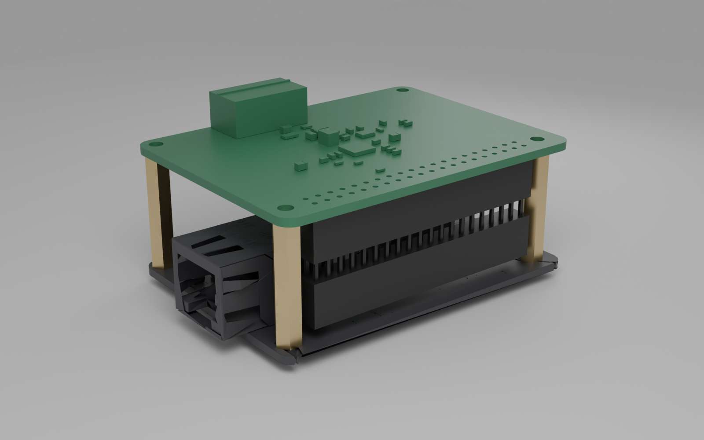
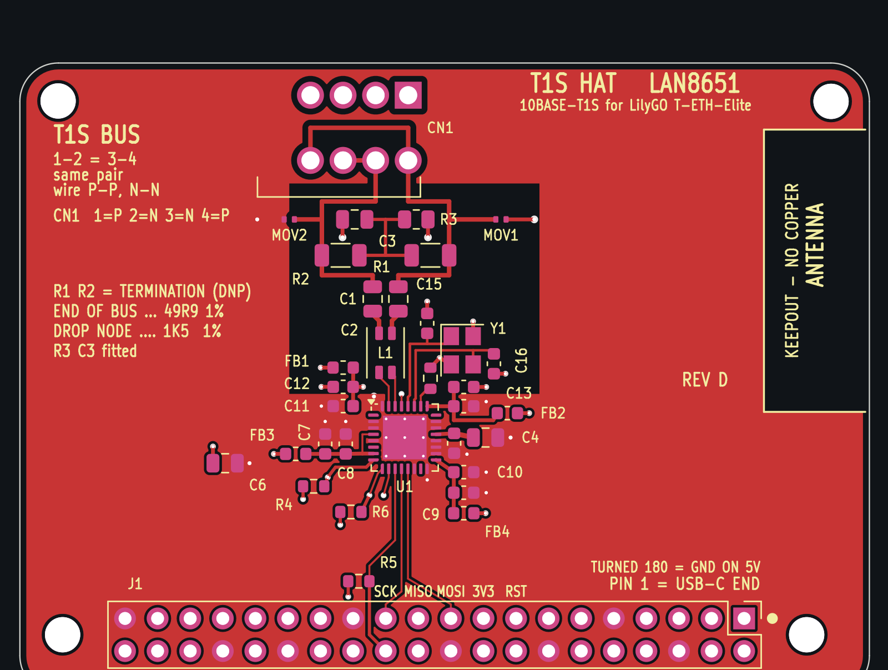
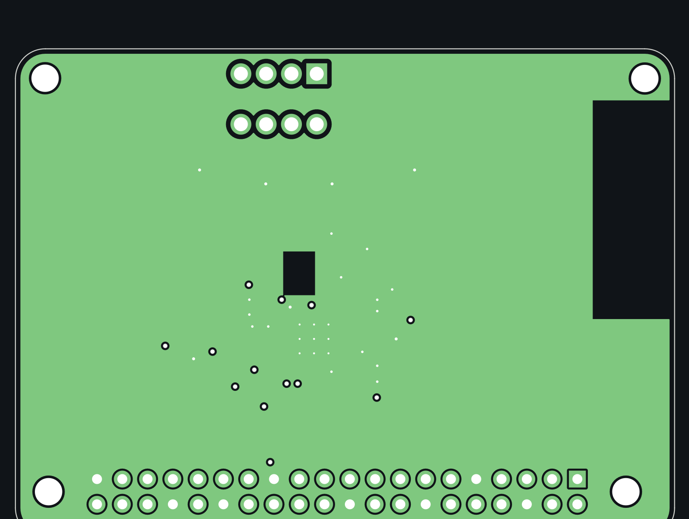

# Elite T1S HAT

A **10BASE-T1S** board for the **LilyGO T-ETH-Elite** (ESP32-S3), built around
the Microchip **LAN8651** MAC-PHY. It stacks on the Elite's 2×20 header and
gives it a single-pair automotive Ethernet port next to the Elite's own
100BASE-TX (W5500). This board is its own design, not a Raspberry Pi HAT on an
adapter.

**3D:** open [`mechanical/model/t1s_hat.stl`](mechanical/model/t1s_hat.stl) or
[`stack.stl`](mechanical/model/stack.stl) on GitHub to turn it in the browser.
There is also a STEP file for CAD work (`t1s_hat.step`).

| board, top | ground plane (In1) |
|---|---|
|  |  |

| folder | what |
|---|---|
| [`hardware/`](hardware/README.md) | KiCad schematic + **4-layer** PCB (Rev C; Rev B at tag `rev-b`), all generated by `make_t1s_hat.py`; gerbers; JLCPCB BOM/CPL. **[`ORDERING.md`](hardware/ORDERING.md) = how to order.** [`ELECTRICAL.md`](hardware/ELECTRICAL.md) = every value and why |
| [`firmware/`](firmware/README.md) | ESP32-S3 node firmware: LAN8651 over OPEN Alliance TC6 SPI, PLCA, ping/UDP, serial console |
| [`mechanical/`](mechanical/GEOMETRY.md) | outline, holes and header grid, measured from LilyGo's own DXF/3D (`reference/measure.py` re-derives them); `model/` has the 3D models (STL, STEP) and their build and render scripts |

## Status (2026-10-02)

| | |
|---|---|
| Design | **Rev C (4-layer) finished, ready to order**, with the pre-fabrication review fixes of 2026-10-02 (CCOMP, VDDAU, VDDA, RBIAS and crystal parts at their pins; exposed-pad paste clear of the thermal vias; see [`hardware/README.md`](hardware/README.md)). DRC 0 errors / 0 warnings, ERC 0 errors, mechanical error 0.00000 mm against `GEOMETRY.md`, 0 unrouted |
| Parts | every fitted part has an LCSC number, all in stock; **LAN8651 is the scarce one (199 at JLC, 2026-10-01)** |
| Firmware | compiles (Arduino esp32 3.3.0). It ran on a third-party LAN8651 HAT on the same pins (9.5 Mbit/s, PLCA, Zenoh); **not yet on this board, since none has been built** |
| Fabricated | **no.** Order 2–3 first, prove SPI + ping + PLCA between two nodes, then the rest |

What only a real board can settle is listed in
[`hardware/README.md`](hardware/README.md) under "What is NOT verified":
crystal oscillation margin, T1S signal quality and EMC, stack height.

## The short version of the design

- **LAN8651, single 3.3 V** from the Elite's header. The '51 regulates its own
  1.8 V core, so the board has no regulator.
- **Host SPI on the Elite's IO11/9/10, CS on IO0 (BOOT strap), IRQ IO39,
  RESET IO42.** These are the pins a Pi HAT would use, so the mainline
  `microchip,lan8651` driver also works on a Pi. Don't press BOOT on a
  running node.
- **Bus side per AN1718:** common-mode choke → 100 nF DC block → termination
  (fit per bus position: 49R9 end / 1K5 drop) → optional ESD → 4-pin 2.54 mm push-in (Rev D)
  terminal block, wired P N N P so a node taps a daisy chain.
- **4 layers (since Rev B):** signals on top, In1 solid GND, In2 +3V3, bottom only three SPI escapes. The T1S pair is 50 Ω by construction (0.35 mm over 0.21 mm of prepreg). Rev A, the 2-layer version, is in git history.

## Where it is used

A networking test bench: ESP32-S3 nodes running Zenoh-pico behind two
TSN switches with FRER (IEEE 802.1CB). The nodes use the Elite's
own W5500 today; this HAT gives them a 10BASE-T1S edge link, and its firmware's
bridge mode joins a T1S segment to the switched 100BASE-TX backbone.

## History

Started as a sub-folder of an earlier adapter project (a Raspberry Pi HAT
carrier for the Elite) and split out on 2026-09-28 with its history, because the
board is its own product.

## License

MIT for everything written here; third-party parts keep their own licences
(listed in [`LICENSE`](LICENSE)).
